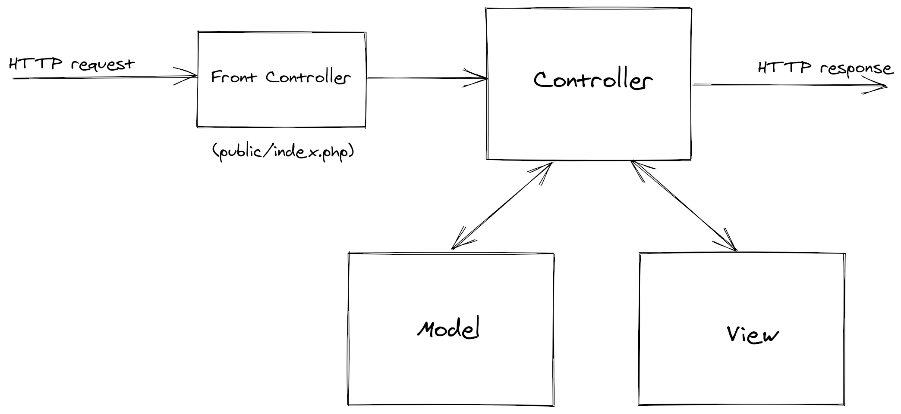

## SimpleMVC

[](https://github.com/simplemvc/framework/actions)

**SimpleMVC** is an MVC framework for PHP based on the [KISS](https://en.wikipedia.org/wiki/KISS_principle) principle:
> "Keep It Simple, Stupid"

The goal of this project is to offer a simple and fast [MVC](https://en.wikipedia.org/wiki/Model%E2%80%93view%E2%80%93controller)
framework for PHP applications.

It uses the [dependency injection](https://en.wikipedia.org/wiki/Dependency_injection) principle to manage
the dependencies between classes and the [FastRoute](https://github.com/nikic/FastRoute) library
for implementing the routing system.

SimpleMVC uses the following PSR standards, from the [PHP-FIG](https://www.php-fig.org/) initiative:

- [PSR-11](https://www.php-fig.org/psr/psr-11/) for DI Container;
- [PSR-7](https://www.php-fig.org/psr/psr-7/) for HTTP message;
- [PSR-3](https://www.php-fig.org/psr/psr-3/) for logging;

This project is used in the course **PHP Programming** by [Enrico Zimuel](https://www.zimuel.it/) at [ITS ICT Piemonte](http://www.its-ictpiemonte.it/),
an Italian tertiary educational institution specialized in Information and Communications Technology in [Turin](https://en.wikipedia.org/wiki/Turin).

## Introduction

SimpleMVC implements the [Model–View–Controller](https://en.wikipedia.org/wiki/Model%E2%80%93view%E2%80%93controller) (MVC)
architectural pattern using [Dependency injection](https://en.wikipedia.org/wiki/Dependency_injection)
and [PSR](https://www.php-fig.org/psr/) standards.

A SimpleMVC application looks as follows:

```php
chdir(dirname(__DIR__));
require 'vendor/autoload.php';

use DI\ContainerBuilder;
use SimpleMVC\App;

$builder = new ContainerBuilder();
$builder->addDefinitions('config/container.php');
$container = $builder->build();

$app = new App($container, require 'config/app.php');
$app->bootstrap();
$app->dispatch();
```

We build a DI container using [PHP-DI](https://php-di.org/) and we create a `SimpleMVC\App` object.
We use an array to configure the `App` object, that is specified using `require 'config/app.php'` in the example.
Then we `bootstrap()` the application and we `dispatch()` the request, that's it!

This example can act as a front controller of an MVC application (see diagram below).



In this diagram the front controller is stored in a `public/index.php` file. 
The `public` folder is usually the document root of a web server.

## Quickstart

You can start using the framework with the [skeleton](https://github.com/simplemvc/skeleton) application.

## Copyright

The author of this software is [Enrico Zimuel](https://github.com/ezimuel/) and other [contributors](https://github.com/simplemvc/framework/graphs/contributors).

This software is released under the [MIT License](/LICENSE).
